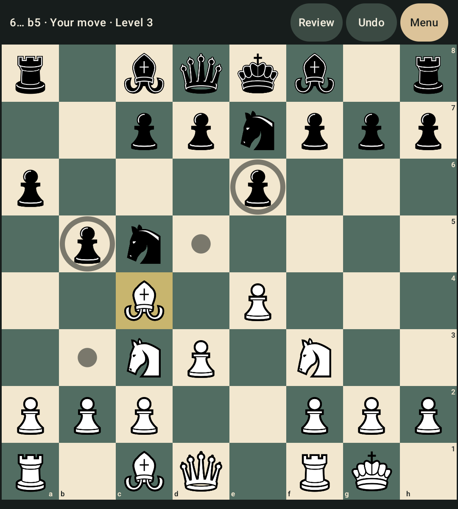
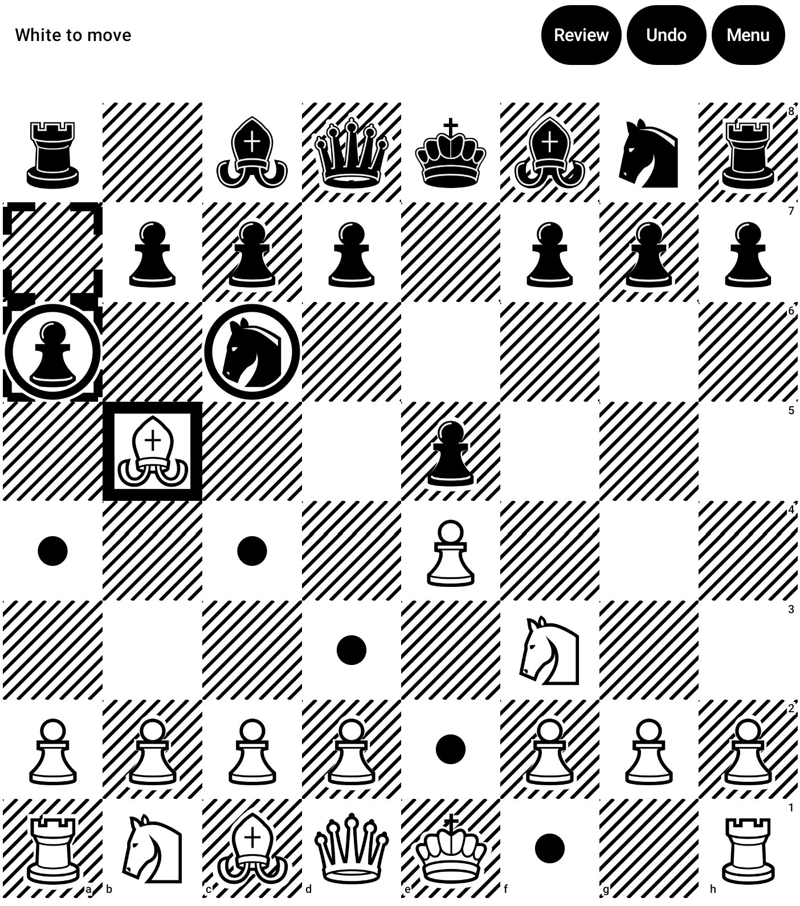
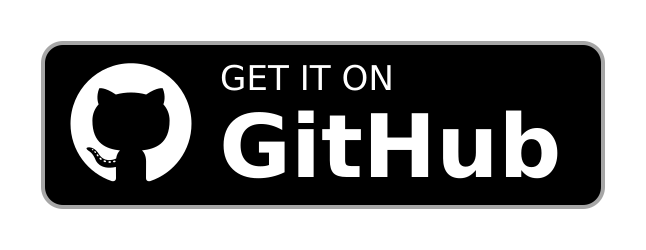

# Square Chess

**Chess built for square screens, compact devices, e-ink and physical keyboards.**

> Square Chess is an offline Android chess app designed for hardware that conventional chess apps often do not use well — while still working on ordinary phones and tablets.

<table>
<tr>
<td align="center"><strong>Compact & square screens</strong></td>
<td align="center"><strong>E-ink mode</strong></td>
</tr>
<tr>
<td></td>
<td></td>
</tr>
</table>

<a href="https://play.google.com/store/apps/details?id=com.dataespresso.squarechess"></a> <a href="https://github.com/chriotte/square-chess/releases/latest"></a>

F-Droid: coming soon

## Why Square Chess?

The board comes first.

Square Chess makes the chessboard as large as possible and fits the interface around the space that remains.

- **Square & compact screens** — designed around unusual screen shapes instead of assuming a tall phone.
- **E-ink displays** — dedicated black-and-white mode with hatched squares, shape-based highlights and no animations.
- **Physical keyboards** — play by typing moves such as `e4`, `Nf3`, `O-O` or `e2e4`.
- **Offline & private** — no account, no ads, no analytics and no Internet permission.

It also works normally on conventional Android phones and tablets.

## Play chess your way

- **Play against the computer** at ten difficulty levels, from beginner-friendly play to full-strength Fairy-Stockfish.
- **Play with a friend** on the same device, with an optional chess clock.
- **Record a real-board game** and review it afterwards move by move.
- **Use touch or keyboard input** — tap, drag or type your moves.
- **Review and manage games** with move history, undo, resign and draw handling.
- **Import and export PGN** for Lichess, ChessBase and other chess software.

Square Chess also includes a standalone chess clock, board customisation, coordinates, legal-move markers, move sounds and vibration.

## Private and offline

Everything runs locally on your device.

**No ads. No account. No analytics. No Internet permission.**

Your games and settings stay on your device.

See the [privacy policy](PRIVACY_POLICY.md).

## Installation

- **Google Play:** [Square Chess on Google Play](https://play.google.com/store/apps/details?id=com.dataespresso.squarechess)
- **GitHub:** [Download the latest release](https://github.com/chriotte/square-chess/releases/latest) — signed APK with its SHA-256 checksum
- **F-Droid:** planned

Google Play and GitHub/F-Droid builds are signed with different keys, so they cannot update one another directly.

To move between builds:

1. Export your games from **Game history → Export**
2. Install the other build
3. Import them using **Game history → Import**

## Supported devices

Square Chess requires:

- Android 10 (API 29) or newer
- ARM64

It is developed and tested on the **Unihertz Titan 2 Elite** and an **Onyx Boox Note3** e-ink tablet, with additional testing for other screen sizes and physical-keyboard devices.

It also works on conventional Android phones and tablets.

See the [device testing plan](docs/testing/test-plan.md).

## Building from source

Requirements:

- JDK 21
- Android SDK, platform 36
- Android NDK 28.2.13676358
- CMake 3.22.1

Build and run the checks with:

```sh
./gradlew check assembleDebug
```

See [Building from source](docs/development/building.md) for full instructions, and [Architecture](docs/architecture/overview.md) for an overview of the project structure.

## Chess engine

Square Chess uses [Fairy-Stockfish](https://github.com/fairy-stockfish/Fairy-Stockfish) with classical evaluation.

The engine is based on the version pinned by the Lichess mobile project's [multistockfish](https://github.com/lichess-org/dart-multistockfish) package and is compiled from source in [`native/fairy/`](native/fairy/).

Difficulty levels use Fairy-Stockfish's own **Skill Level** and **MultiPV** settings rather than a custom move-weakening algorithm.

See the [engine documentation](docs/engine/) for calibration and implementation details.

## Contributing

Contributions, bug reports and suggestions are welcome.

See:

- [CONTRIBUTING.md](CONTRIBUTING.md)
- [SECURITY.md](SECURITY.md)

## Author

Square Chess is designed and built by **Christopher Ottesen**.

If you want to support development, you can donate on [Liberapay](https://liberapay.com/chriotte).

## Licence

Square Chess is free software licensed under the [GNU General Public License v3.0 or later](LICENSE).

Third-party components and their licences are documented in [THIRD_PARTY_LICENSES.md](THIRD_PARTY_LICENSES.md).

Google Play and the Google Play logo are trademarks of Google LLC. The GitHub download badge is by @flocke under CC BY-SA 3.0 ([details](docs/images/badges/README.md)).
